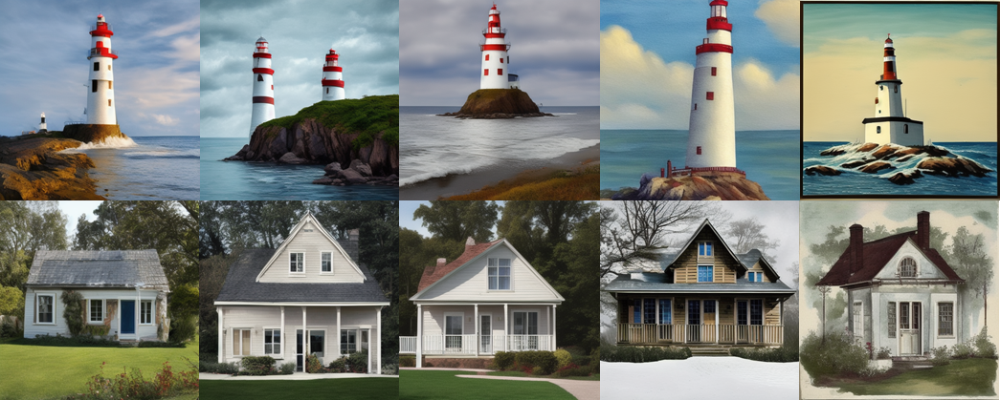
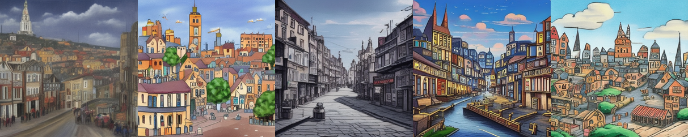

# test_lora_train

classic install
python >= 3.11

<code>python3 -m venv .venv</code>

<code>source .venv/bin/activate</code>

<code>python3 -m pip install --upgrade pip</code>

<code>python3 -m pip install -r requirements.txt</code>

__download tiny models to local__

<code>python3 -m models/download_models_to_local</code>

заполнить верхние поля и запустить pipeline_learn_lora.py

<code>python3 -m pipeline_learn_lora</code>

__pipeline_fit_lora.py__ - пайплайн обучение нескольких версий лора

__pipeline_run_lora.py__ - паплайн получения картинок из дифузии

__main.py__ - запуск обоих пайплайнов

example (left no lora | add lora): 
style acrylic paints

example (left no lora | and add lora): 
style multic anime

example (left no lora | and add lora): 
style cyberpunk

lets just for fun overfiting lora))